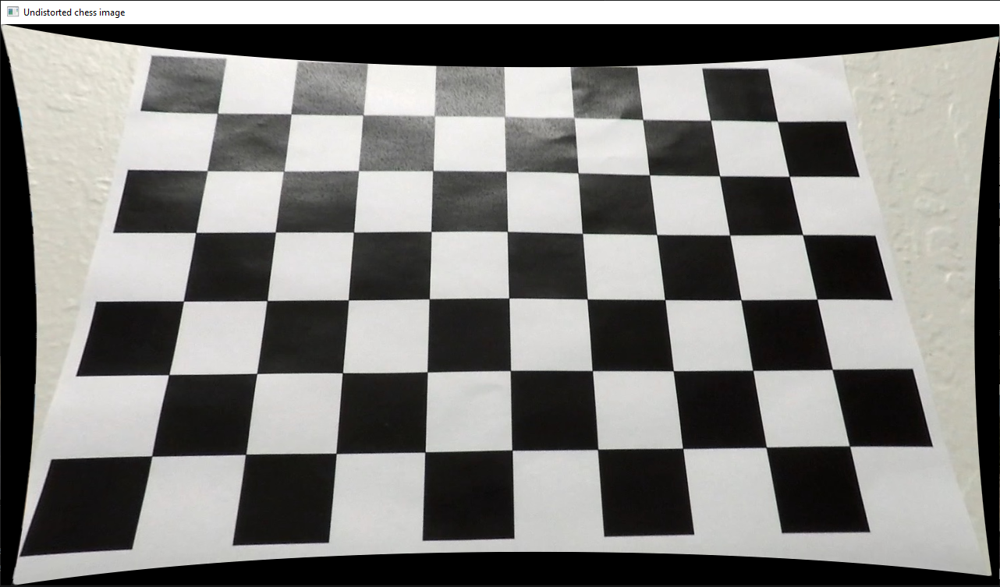
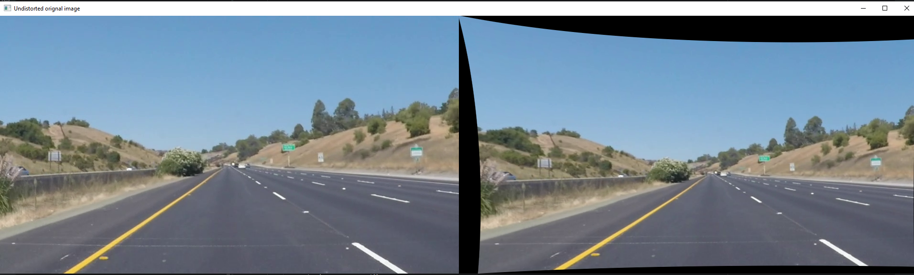
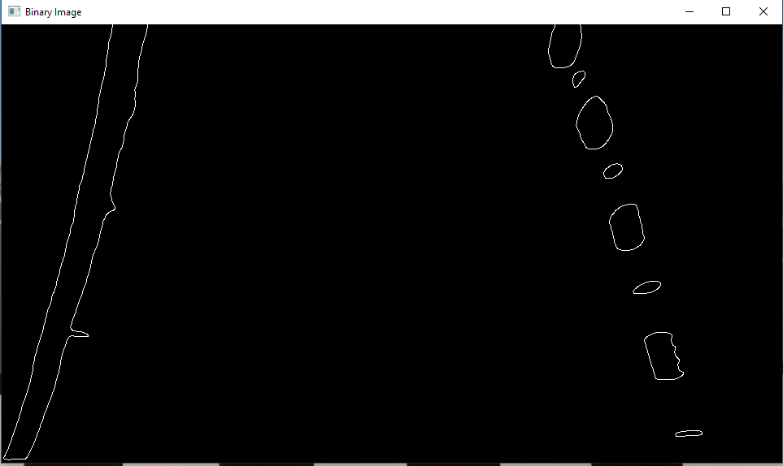
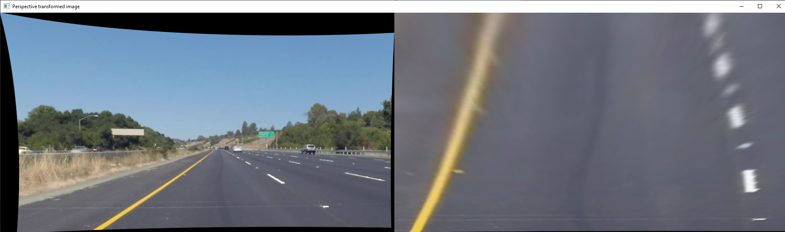
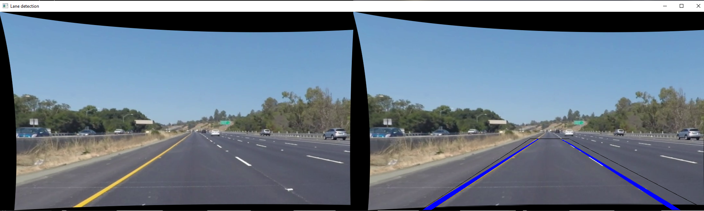

## Writeup Template

### You use this file as a template for your writeup.

---

**Lane Finding Project**

The goals / steps of this project are the following:

* Compute the camera calibration matrix and distortion coefficients given a set of chessboard images.
* Apply a distortion correction to raw images.
* Use color transforms, gradients, etc., to create a thresholded binary image.
* Apply a perspective transform to rectify binary image ("birds-eye view").
* Detect lane pixels and fit to find the lane boundary.
* Determine the curvature of the lane and vehicle position with respect to center.
* Warp the detected lane boundaries back onto the original image.
* Output visual display of the lane boundaries and numerical estimation of lane curvature and vehicle position.

[//]: # (Image References)

[image1]: ./examples/undistort_output.png "Undistorted"
[image2]: ./test_images/test1.jpg "Road Transformed"
[image3]: ./examples/binary_combo_example.jpg "Binary Example"
[image4]: ./examples/warped_straight_lines.jpg "Warp Example"
[image5]: ./examples/color_fit_lines.jpg "Fit Visual"
[image6]: ./examples/example_output.jpg "Output"
[video1]: ./project_video.mp4 "Video"

---

### Writeup / README

#### 1. Provide a Writeup that includes all the rubric points and how you addressed each one.

Napisana dokumentacija ispod.

### Camera Calibration

#### 1. Briefly state how you computed the camera matrix and distortion coefficients. Provide an example of a distortion corrected calibration image.

Na osnovu šahovske table koja je uslikana iz više uglova, vrši se kalibracija kojom ce se dobiti matrica kamere i koeficijenti distorzije.
Bitan je broj unutrašnjih uglova (u ovom slučaju 6,9), za pronalaženje unutrašnjih uglova koristi se funkcija cv2.findChessboardCorners, dok se za pronalaženje parametara kalibracije koristi funkcija cv2.calibrateCamera.
Dobijeni parametri se zapisuju u camera_params.npz, koji se posle u main funkciji čitaju i koriste za korekciju distorzije.
Korekcija distorzije je uradjena primenom funkcije cv2.undistort, kao jedan od njenih parametara se koristi matrica kamere koja je dobijena korišćenjem funkcije cv2.getOptimalNewCameraMatrix.

Original:

Slika korektovane distorzije:

### Pipeline (single images)

#### 1. Provide an example of a distortion-corrected image.

#### 2. Describe how (and identify where in your code) you used color transforms, gradients or other methods to create a thresholded binary image.  Provide an example of a binary image result.

Konvertovanje slike iz BGR u crno-belu je urađeno funkcijom cv2.cvtColor na liniji 148.
Takva slika se koristi kao parametar za sledeću funkciju i svaka sledeća obrada se koristi kao parametar za narednu obradu.
Za smanjenje šuma se koristio Gausov filter cv2.GaussianBlur linija 149.
Za pravljenje binarne slike se koristi cv2.threshold linija 150.
Posle toga se koristi canny = cv2.Canny(thrash, 120, 240) za detekciju ivica (linija 151), sto je kasnije korišćeno za detekciju linija, odnosno traka.

#### 3. Describe how (and identify where in your code) you performed a perspective transform and provide an example of a transformed image.

Za dobijanje transformacione matrice koristila se funckija cv2.getPerspectiveTransform(srcPoints, dstPoints), linija 140.
Ona za parametre ima ključne tačke na originalnoj slici (srcPoints) koje predstavljaju region interesa koji ce posle biti iscrtan kao trapez (pravougaonik) kod detekcije traka i drugi parametar je dstPoints gde ce se te tačke naći posle transformacije, kako ce izgledati ispravljena slika iz ptičje perspektive, linije 121-133.
Transformaciona matrica se posle koristi kao parametar za funkciju cv2.warpPerspective(undistortedImg, transformMatrix, (imgW, imgH)) kojom se dobija transformisana slika, linija 141.

#### 4. Describe how (and identify where in your code) you identified lane-line pixels and fit their positions with a polynomial?

Za detekciju linija, odnosno traka koristi se funkcija cv2.HoughLinesP (linija 154), koja kao jedan od ulaznih parametara koristi sliku gde su detektovane ivice funkcijom cv2.Canny.
U odnosu na sredinu slike (linija 158) se odredjuju leva i desna traka (linije 160-171), nakon čega se trake iscrtavaju funkcijom drawLane(img, lanePoints).
U okviru funkcije drawLane(img, lanePoints), linije 65-84, se koristi np.polyfit za dobijanje kvadratne funkcije koja opisuje liniju, nakon čega se poziva funkcija za iscrtavanje trake cv2.polylines.
Na kraju se istim funkcijama za transformaciju perspektive vraca slika iz ptičje perspektive u redovnu funckijama cv2.getPerspectiveTransform i cv2.warpPerspective, linije 176-177.

#### 5. Describe how (and identify where in your code) you calculated the radius of curvature of the lane and the position of the vehicle with respect to center.

Nije uređeno još uvek. Osnova postoji gde se koristi detekcija ivica, fitovanje trake funkcijom np.polyfit i iscrtavanje trake u funkciji drawLane.
Potrebno je pravilno fitovati trake, izračunati poluprečnik krivine i iscrtavati trake kroz više frejmova/slika.

#### 6. Provide an example image of your result plotted back down onto the road such that the lane area is identified clearly.

### Pipeline (video)

#### 1. Provide a link to your final video output.  Your pipeline should perform reasonably well on the entire project video (wobbly lines are ok but no catastrophic failures that would cause the car to drive off the road!).

https://drive.google.com/file/d/12--nhwSZzN-59vKuyMCevsF1lembJDNh/view?usp=sharing

### Discussion

#### 1. Briefly discuss any problems / issues you faced in your implementation of this project.  Where will your pipeline likely fail?  What could you do to make it more robust?

Tokom izrade projekta bilo je potrebno naći dovoljno dobre parametre pri određivanju regiona od interesa, jer se dešavalo ako je veći nego sto treba da se detektuju nepotrebne ivice i samim tim da se pogrešno detektuju trake na putu.
Mogući problemi mogu nastati pri lošem osvetljenju, lošim uslovima na putu, naglim promenama osvetljenja.
Projekat se može unaprediti kako bi se mane minimalizovale, kako variranje osvetljenja i detektovanje loših ivica ne bi uticali na pogresnu detekciju traka.
Takođe, nije urađeno dobro izračunavanje krivina i detektovanje linija u tim slučajevima.

